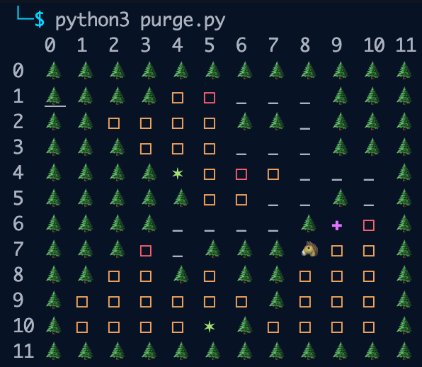
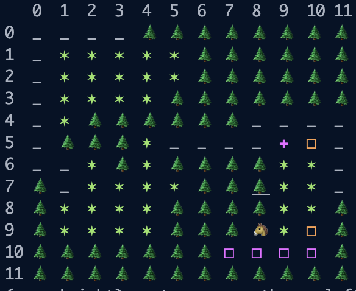
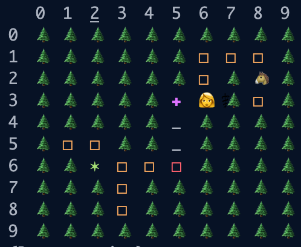
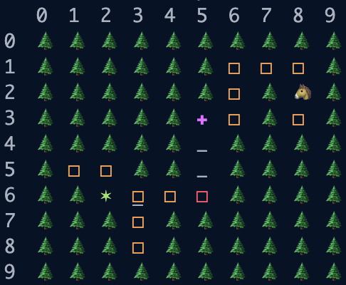
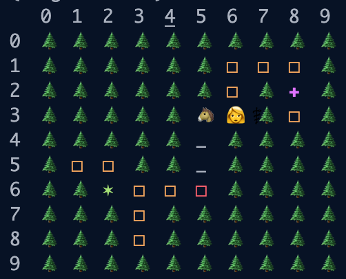

<h1>Screenshots</h1>

|Result                                          | Description                                                 |
|------------------------------------------------| ------------------------------------------------------------|
|</img>| A randomly generated map (12*12) with 3 cities in it |
|</img>| Purple squares indicates cell that cannot be infected because of Knight's action |
|</img>| Doctor places a nurse |
|</img></img>| Knight swapping position with Doctor |

<h1>Introduction</h1>

This game is inspired by both board games—Pandemic and Monopoly. In this game, players have to work with each other and try to eradicate the diseases in all cities. A player would be either doctor or knight (in current version), and different specialties will have different skills to perform during each turn. The diseases win by spreading to all cities, and occupy more than 60% of the cells in each city. The players win by curing all diseases.

<h1>Game Rules</h1>
<h2>Action</h2>
<ul>
    <li>
        <h4>Doctor</h4>
        <ul>
            <li>
                Can place a nurse in any adjacent cell (who can then cure infections in a 3x3 square centered around the position of the nurse)
                
The nurse can cure infections in a 3x3 square centered around the position of the nurse. After performing this, the nurese will die

            </li>
            <li>Can sacrifice movement for another action in the same turn</li>
            <li>Can perform curing infections in the entire row and column according to doctor's current location</li>
        </ul>
    </li>
    <li>
        <h4>Knight</h4>
        <ul>
            <li>Can swap position with the doctor</li>
            <li>Can perform throwing disinfectant two cells away from the knight's current position, the disinfectant can stops diseases from spreading for 2 whole rounds</li>
        </ul>
    </li>
    <li>
    <h4>Disease</h4>
    <ul>
        <li>At the end of each round, inside each city, all possible edge diseases can be picked as the root for disease spreading.</li>
        <li>Disease can spread to another city if its current position is at a gate (red square)</li>
        <li>Disease cannot grow to purple cell (cell that are disinfected)</li>
    </ul>
   </li>
</ul>

<h1>Used Selected Algorithms</h1>
<ol>
    <li><b>A Star Search </b>is used for connecting city to city. I first find the edge of the city, and randomly picked two positions, one for each city. Then, do an A* search to find the shortest path. </li>
    <li><b>Union Find</b> is used in multple places. For example, verifying how many random cities has been generated. I am using the most top-left position as the root for each connected cell. </li>
</ol>

<h1>References</h1>
<ol>
   <li><a href="https://www.zmangames.com/en/games/pandemic/">Pandemic</a></li>
   <li><a href="https://en.wikipedia.org/wiki/Monopoly_(game)">Monopoly</a></li>
</ol>

<h1>Old Repository</h1>
<a href="https://github.com/jackfromillinois/Purge">https://github.com/jackfromillinois/Purge</a>
